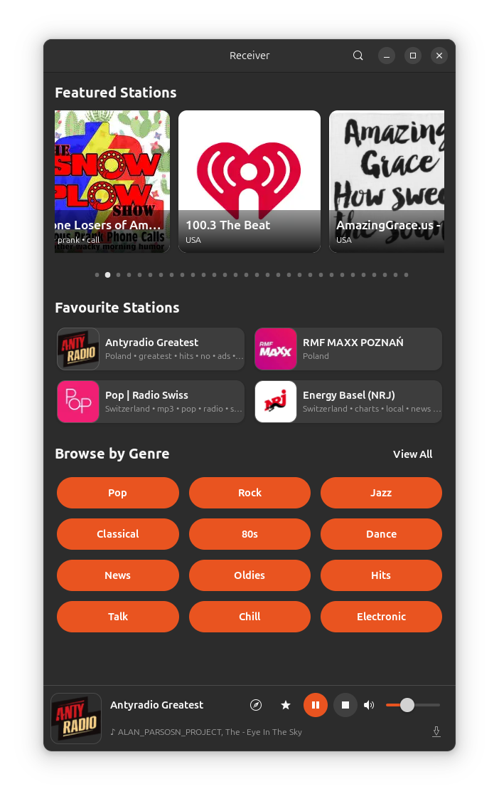

# Receiver

**Internet radio player for GNOME**

[](https://github.com/meehow/receiver/releases)
[](LICENSE)

Receiver is a modern internet radio player built with GTK 4 and Libadwaita, featuring a curated collection of over 30,000 pre-scanned and verified stations from around the world.



## Features

- 📻 **30,000+ curated stations** — all pre-scanned and verified for reliability
- 🔍 **Browse & search** — find stations by genre, country, or keyword
- ⭐ **Favourites** — save stations for quick access
- 🎵 **Wide format support** — MP3, AAC, Ogg, and HLS streams
- 💾 **Session persistence** — resume where you left off
- 🌍 **Translations** — Czech, German, Spanish, French, Hindi, Hungarian, Indonesian, Italian, Japanese, Korean, Dutch, Polish, Portuguese, Swedish, Turkish, Ukrainian, Chinese (Simplified & Traditional)
- 🎛️ **MPRIS integration** — control playback from your desktop environment

## Installation

### Debian / Ubuntu

Download the latest `.deb` package from the [Releases page](https://github.com/meehow/receiver/releases).

```sh
sudo apt install ./receiver_*.deb
```

### From source

#### Dependencies

```sh
sudo apt install \
    meson \
    valac \
    libgtk-4-dev \
    libadwaita-1-dev \
    libgstreamer1.0-dev \
    libsoup-3.0-dev \
    libjson-glib-dev \
    libjavascriptcoregtk-6.0-dev \
    libsqlite3-dev \
    gstreamer1.0-plugins-base \
    gstreamer1.0-plugins-good
```

#### Build & install

```sh
meson setup builddir
meson compile -C builddir
sudo meson install -C builddir
```
