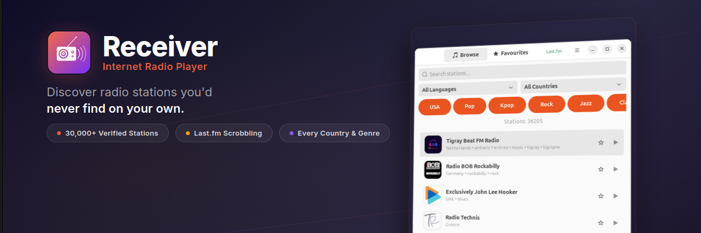

# Receiver

**Discover radio stations you'd never find on your own.**

Most radio apps make you search for stations by name or paste in a stream URL. Receiver flips that around — it ships with **30,000+ stations** ready to explore, each one verified and working, with clean logos, organized by tags, country and language. Just open the app and start discovering.

[](https://snapcraft.io/receiver)
[](https://github.com/meehow/receiver/releases)
[](LICENSE)



## Why Receiver?

Every station in Receiver has been **individually scanned** to verify it's reachable and actually streaming. Duplicates have been removed, broken streams filtered out, and logos fetched in proper resolution — so what you see is a clean, reliable station list, not a dump of 50,000 half-dead URLs.

No sign-up. No ads. No popularity rankings deciding what you hear. Just radio.

## Features

- 📻 **30,000+ curated stations** — deduplicated, scanned, and verified
- 🎨 **High-quality logos** — prioritized stations with a clean, properly sized icon
- 🔍 **Browse & search** — find stations by tags, country or language
- ⭐ **Favourites** — save stations for quick access
- 🎵 **Wide format support** — MP3, AAC, Ogg, and HLS streams
- 💾 **Session persistence** — resume where you left off
- 🎛️ **MPRIS integration** — control playback from your desktop environment
- 🌍 **130 languages** — translated for users around the world

## Install

### Snap Store

[](https://snapcraft.io/receiver)

```sh
sudo snap install receiver
```

### Debian / Ubuntu

Download the latest `.deb` package from the [Releases page](https://github.com/meehow/receiver/releases).

```sh
sudo apt install ./receiver_*.deb
```

### From source

See [CONTRIBUTING.md](CONTRIBUTING.md) for build instructions and development setup.

## Links

- [Report a bug](https://github.com/meehow/receiver/issues)

